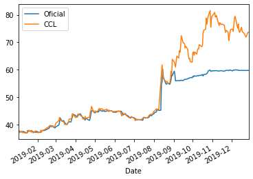

# Trading Calculator
Hola, voy a ir subiendo a este repo herramientas de calculo útiles para el trading, armadas en Python.
Voy a ir subiendo las herramientas a https://lucasgday.pythonanywhere.com, un sitio desarrollado con Dash.

Te agradezco los comentarios y revisiones que hagas al código!

# Contenido

## ARSUSDCCL
Cálculo de cotización del dólar bolsa en pesos argentinos.

Se descarga la cotización de GGAL en $ y en USD para calcular el tipo de cambio, y se compara con el tipo de cambio oficial.

Se propone una descarga de datos desde el 1/1/19 y una actualización a partir del archivo descargado, en los 2 scripts publicados, usando la libreria yfinance(https://pypi.org/project/yfinance/) como base para la descarga desde Yahoo! Finance.

A continuación una copia del gráfico generado:

## Trailing-Stop-Loss
Acá comparto un Jupyter Notebook que usé para poder calcular un % de trailing stop loss en función de las caídas diarias calculadas como mínimo vs cierre previo.
El caso lo hice para el ETF OIH desde mediados de Marzo 2020.
